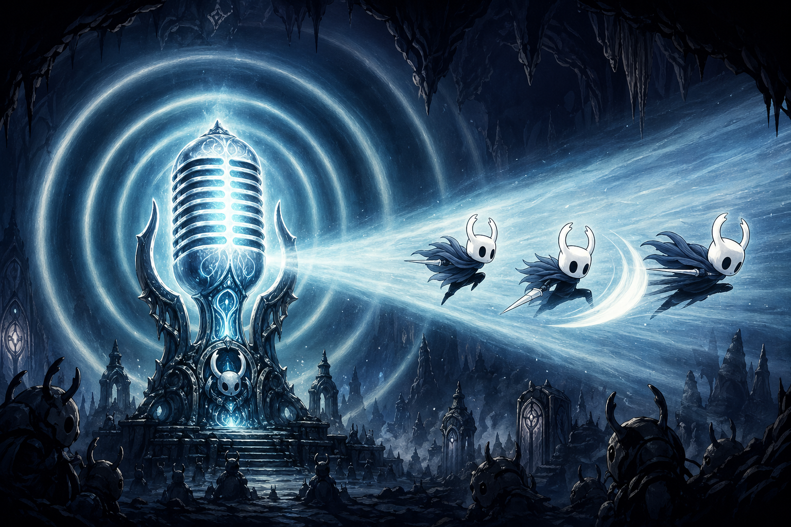

# HkVoiceMod

把《空洞骑士》变成可以“喊出来玩”的版本。

`HkVoiceMod` 是一个离线中文语音控制 Mod。打开麦克风后，你可以直接说出命令词，让小骑士移动、跳跃、攻击、冲刺、放法术，或者把一整段按键动作录成一条语音宏。

## 这是什么玩法

- 探图时可以直接喊“往左”“往右”“跳跃”，把移动压力从手上分一部分到嘴上。
- 战斗时可以快速喊“攻击”“冲刺”“上吼”“下砸”“法术”，玩出一种半声控半手操的节奏。
- 左右移动默认是持续按住的，说“停止”就会松开，适合跑图、站位和整活挑战。
- 语音输入会和你当前的键盘/手柄输入叠加，不会强行覆盖你原本的操作。
- 整套识别在本地完成，不依赖联网。

## 默认喊话

| 唤醒词 | 触发动作 | 默认表现 |
| --- | --- | --- |
| `往上` | 上 | 按住约 `0.5s` |
| `往下` | 下 | 按住约 `0.5s` |
| `往左` | 左移 | 持续按住，直到说 `停止` |
| `往右` | 右移 | 持续按住，直到说 `停止` |
| `攻击` | 攻击 | 短按一次 |
| `跳跃` | 跳跃 | 按住约 `0.5s` |
| `冲刺` | 冲刺 | 短按一次 |
| `上吼` | 上 + 法术 | 组合短按 |
| `下砸` | 下 + 法术 | 组合短按 |
| `法术` | 法术 | 短按一次 |
| `停止` | 停止持续动作 | 释放语音保持中的方向/宏按键 |

## 可以怎么玩

- 探索流：喊“往右”持续前进，遇到地形时补一句“跳跃”，需要精确站位时再喊“停止”。
- 战斗流：用手负责细操作，用嘴补“攻击”“冲刺”“法术”，能明显减轻同时按多个键的压力。
- 法术流：把“上吼”“下砸”“法术”分开喊，能更直观地把法术方向说出来。
- 整活流：给复杂动作录一条宏，用一句中文直接打出你常用的一套按键顺序。

## 自定义内容

游戏里的自定义编辑器支持：

- 修改每条语音宏的唤醒词和阈值。
- 修改单独的“停止词”。
- 新增语音宏，并录制完整的按下/松开/间隔时序。
- 录制时直接按你当前游戏里绑定的按键，把它们做成一句话触发的动作。
- 用语音宏触发更多游戏按钮，不只限于默认的移动、攻击、跳跃、冲刺和法术。

## 安装与使用

1. 把打包好的 `HkVoiceMod` 文件夹放到 `Hollow Knight/hollow_knight_Data/Managed/Mods/`。
2. 确保你的 Hollow Knight 已有常规 Mod 环境，并已安装 `Satchel`。
3. 连接并启用麦克风。
4. 进入游戏后打开 Mod 菜单，找到 `HkVoiceMod`，再点“打开自定义编辑器”。
5. 先用默认词测试手感，再按你的习惯改唤醒词、阈值、停止词和语音宏。

## 使用建议

- 当前版本面向 Windows 麦克风链路。
- 唤醒词目前只支持中文字符。
- 这是关键词识别，不是整句语音助手。词越短越快，词越清晰越稳。
- 如果某条命令总是不好识别，优先把它改成更清楚的 2 到 4 个字，再适当调低阈值。
- 仓库已经内置离线中文关键词模型，正常打包后可以直接随 Mod 一起分发。

## 技术说明

面向构建、打包和源码使用的技术 README 在 `HkVoiceMod/README.md`。
